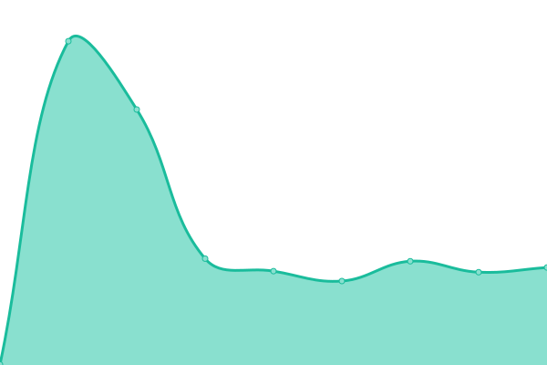

# [📈 Live Status](https://status.mplabs.cloud): <!--live status--> **🟧 Partial outage**

This repository contains the open-source uptime monitor and status page for [Felix Dürrwald](https://www.mplabs.de/), powered by [Upptime](https://github.com/upptime/upptime).

With [Upptime](https://upptime.js.org), you can get your own unlimited and free uptime monitor and status page, powered entirely by a GitHub repository. We use [Issues](https://github.com/mplabs/upptime/issues) as incident reports, [Actions](https://github.com/mplabs/upptime/actions) as uptime monitors, and [Pages](https://status.mplabs.cloud) for the status page.

<!--start: status pages-->
<!-- This summary is generated by Upptime (https://github.com/upptime/upptime) -->
<!-- Do not edit this manually, your changes will be overwritten -->
<!-- prettier-ignore -->
| URL | Status | History | Response Time | Uptime |
| --- | ------ | ------- | ------------- | ------ |
|  [MPLabs' Nextcloud](https://nextcloud.mplabs.cloud) | 🟩 Up | [mp-labs-nextcloud.yml](https://github.com/mplabs/upptime/commits/HEAD/history/mp-labs-nextcloud.yml) | 

 1309ms
     
 | 

<a href="https://status.mplabs.cloud/history/mp-labs-nextcloud">100.00%</a>
    

|  [felixduerrwald.de](https://www.felixduerrwald.de) | 🟥 Down | [felixduerrwald-de.yml](https://github.com/mplabs/upptime/commits/HEAD/history/felixduerrwald-de.yml) | 

 432ms
     
 | 

<a href="https://status.mplabs.cloud/history/felixduerrwald-de">98.47%</a>
    

|  [Mariana Friedrich](https://www.mariana-friedri.ch) | 🟩 Up | [mariana-friedrich.yml](https://github.com/mplabs/upptime/commits/HEAD/history/mariana-friedrich.yml) | 

 1638ms
     
 | 

<a href="https://status.mplabs.cloud/history/mariana-friedrich">100.00%</a>
    

<!--end: status pages-->

[**Visit our status website →**](https://status.mplabs.cloud)

## 📄 License

- Powered by: [Upptime](https://github.com/upptime/upptime)
- Code: [MIT](./LICENSE) © [Anand Chowdhary](https://anandchowdhary.com), supported by [Pabio](https://pabio.com)
- Data in the `./history` directory: [Open Database License](https://opendatacommons.org/licenses/odbl/1-0/)
